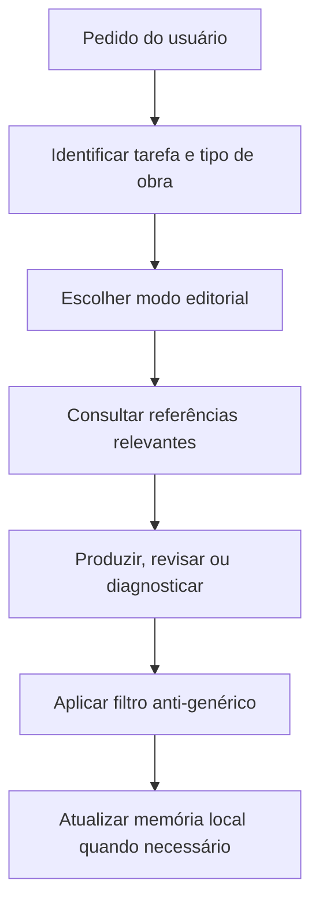

<div align="center">

# Grande Sabio Skill


Uma skill editorial, literária e narrativa em português brasileiro, criada por **Newton Alves** para apoiar escrita, revisão, estruturação e continuidade de obras com rigor de equipe editorial.

[Instalação](docs/INSTALACAO.md) · [Como usar](docs/USO.md) · [Memória local](docs/MEMORIA_LOCAL.md)

</div>

---

## Visão Geral

A **Grande Sabio** nasceu para trabalhar com textos em português brasileiro como uma equipe editorial condensada: lê o pedido, identifica o tipo de tarefa, escolhe o modo certo e entrega uma resposta prática, com atenção a voz autoral, coerência, estrutura, continuidade e acabamento.

Ela foi criada para autores, roteiristas, criadores de mundos ficcionais, desenvolvedores de jogos narrativos e projetos editoriais que precisam de um fluxo de trabalho mais sério do que uma resposta solta.

O foco é Brasil. O idioma padrão é **português brasileiro**. A skill não usa português europeu como referência de estilo, vocabulário ou revisão.

## Instalação

Instale com:

```bash
npx skills add NewtonAlves/Grande-Sabio-Skill
```

Se o nome do repositório for diferente, substitua pelo slug correto:

```bash
npx skills add NewtonAlves/<nome-do-repositorio>
```

## Para Que Ela Foi Criada

Eu criei a **Grande Sabio** para ajudar no desenvolvimento de obras e projetos narrativos que precisam de consistência. Ela não foi pensada para dar respostas genéricas; foi pensada para trabalhar como apoio editorial contínuo.

Ela ajuda em:

| Área | O que a skill faz |
| --- | --- |
| Escrita literária | cria cenas, capítulos, contos, diálogos e descrições |
| Revisão PT-BR | corrige ortografia, pontuação, concordância, regência, crase e naturalidade |
| Copidesque | melhora clareza, ritmo, fluidez e coesão |
| Desenvolvimento narrativo | analisa enredo, arco, progressão, ritmo e furos |
| Personagens | cria desejo, medo, falha, voz, relações e arco |
| Worldbuilding | cria culturas, regiões, sistemas, conflitos e consequências |
| Nomes | cria nomes de personagens, lugares, facções, habilidades e itens |
| Jogos narrativos | cria lore, quests, NPCs, classes, bestiários e diálogos interativos |
| Revista | cria pauta, lead, matéria, coluna, editorial e estrutura de seções |
| Publicação textual | ajuda com sinopse, apresentação, prólogo, epílogo e quarta capa |
| Audiolivro | ajusta ritmo oral, pausas, fôlego e pronúncia |
| Memória local | preserva decisões, continuidade, personagens, mundo e progresso |

## Rigor Editorial

A **Grande Sabio** foi pensada para não tratar texto como peça solta. Ela observa o que uma alteração muda no restante da obra, separa problema estrutural de problema de frase e evita polir superfície quando a base narrativa ainda precisa de ajuste.

Na prática, isso significa:

- revisar obras longas com atenção a efeitos em cascata;
- diagnosticar frase, ritmo e voz sem apagar a intenção do autor;
- avaliar premissa pela promessa de leitura, não apenas pelo cenário;
- manter gênero principal e gêneros secundários em equilíbrio;
- combater clichês pela função narrativa, não só trocando aparência.

## Modos De Trabalho

A skill trabalha com 16 modos internos:

<details>
<summary>Ver modos</summary>

1. Modo Escritor
2. Modo Redator
3. Modo Roteirista
4. Modo Editor De Desenvolvimento
5. Modo Editor Literário
6. Modo Revisor PT-BR
7. Modo Copidesque
8. Modo Leitor Crítico
9. Modo Criador De Personagens
10. Modo Criador De Mundo
11. Modo Criador De Nomes
12. Modo Narrativa Para Jogos
13. Modo Revista
14. Modo Contos E Antologias
15. Modo Memória E Continuidade
16. Modo Auditoria Final

</details>

## Como Usar

Chame a skill pelo nome técnico:

```text
Use $grande-sabio para revisar este capítulo mantendo minha voz.
```

Outros exemplos:

```text
Use $grande-sabio para criar uma antagonista para fantasia juvenil, com desejo, medo, falha e contradição.
```

```text
Use $grande-sabio para diagnosticar por que meu conto parece genérico e sugerir uma correção concreta.
```

```text
Use $grande-sabio para criar uma facção, três NPCs e uma quest para meu RPG.
```

```text
Use $grande-sabio para continuar minha obra lendo primeiro project-memory.
```

## Fluxo Da Skill



## Estrutura Do Repositório

```text
grande-sabio/
├── SKILL.md
├── README.md
├── agents/
│   └── openai.yaml
├── docs/
│   ├── INSTALACAO.md
│   ├── USO.md
│   └── MEMORIA_LOCAL.md
├── examples/
├── references/
└── templates/
```

## Memória Local

Projetos longos perdem força quando decisões importantes ficam espalhadas. Por isso, a **Grande Sabio** orienta o uso de uma pasta `project-memory/` dentro do projeto da obra.

Essa memória registra:

- estado atual da obra;
- progresso;
- pendências;
- decisões tomadas;
- decisões em aberto;
- personagens;
- mundo ficcional;
- linha do tempo;
- locais;
- glossário;
- banco de nomes;
- continuidade;
- notas de revisão;
- fontes consultadas;
- resumos de sessão.

Veja o guia completo em [docs/MEMORIA_LOCAL.md](docs/MEMORIA_LOCAL.md).

## Limites

A **Grande Sabio** trabalha com escrita, revisão, narrativa, estrutura editorial e continuidade. Ela não promete publicação, vendas, sucesso comercial, tráfego, campanhas, funis, distribuição, parecer jurídico, registro autoral, impressão, diagramação avançada ou resultado de mercado.

Quando houver dúvida real sobre português brasileiro, a skill orienta consulta a fontes confiáveis, como ABL/VOLP, dicionários brasileiros e manuais editoriais.

## Criador

Criada por **Newton Alves**.

GitHub: [github.com/NewtonAlves](https://github.com/NewtonAlves)
